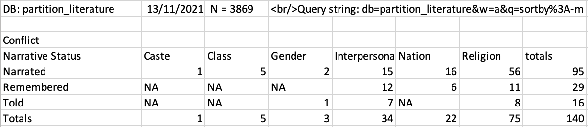
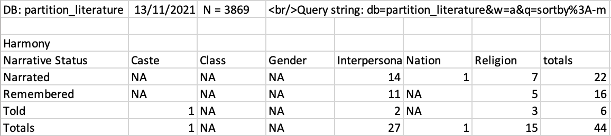
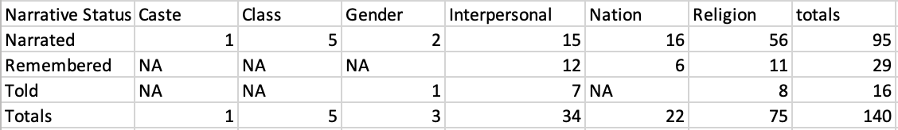
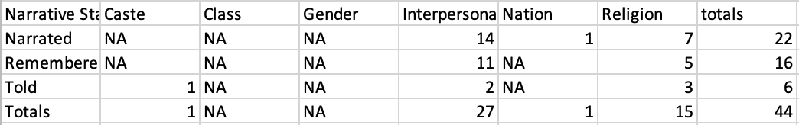
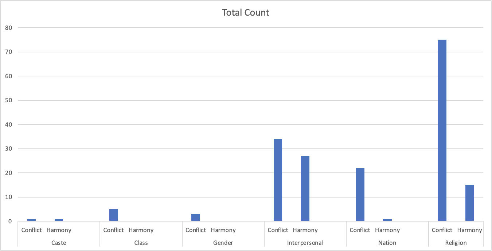

### Research Question
**What is the relationship between the narrative status of an event and the event modality?**

### Operationalised Queries
1. We used the Events search to investigate the frequency of the remembered, narrated and told narrative status of events with conflict and harmony under event modality.
2. We further employed the same tool to investigate the narrative status of interpersonal and religious events within conflict and harmony under event modality.

### Crosstab

### Analysis

To conduct our analysis, we reached to external sources to gauge the overarching trend observed in partition literature. Events such as the partition have widespread consequences both spatially and temporally and inspire artists to document this event across various mediums, especially in literature. Supplementing our database with external sources allows us to understand these trends and observe it from an alternate perspective. One such paper we have used to conduct our analysis is titled THE PLIGHT OF COMMON PEOPLE IN THE PARTITION LITERATURE OF INDIAN SUBCONTINENT by Aijaz Ahmad Ganie & M.S. Rathor. 

According to Ganie and Rathor, the common features of partition literature include commentary and instances of hooliganism, treachery, barbarism, rape, murder and abduction - all events which constitute conflict. One of the stories inputted by our group was The Crusader which focused on the abduction of a Sikh woman and her rescue by a muslim man - the crusader. With instances popping up in the themes of the stories, we wanted to see if the database on Manto and Sarna followed the same trend as documented by Ganie and Rathor in their paper. 

#### Hypothesis: 
The database on Manto and Sarna has more inputted instances of conflict over harmony, thus following the trend in partition literature as documented by Ganie and Rathor 

#### Observations: 

Table 1’s total is more than 300% that of table 2’s with the values at 140 and 44 respectively. This observation shows that there are more instances of conflict, be it narrated, told or remembered, than there are instances of harmony. 

The same trend can be observed in other columns with religious conflict observed as inputted 5 times more than religious harmony with the numbers at 75 and 15 respectively. That is a 400% increase in instances of religious conflict over that of harmony. 

The gulf between literature on conflict and harmony is exemplified in the Nation column with 1 instance being reported of national harmony over 22 of national conflict

In both tables, the narrative status is dominated by narration with the total being 95 and 22 in Table 1 and Table 2 respectively. This facet is better explained by the visualisations that are to follow.  

### Visualisation

### Reflection
The process of data entry allowed us to not only analyse the story from merely reading it but also flipped our perspective and decoded the events that wouldn’t have been possible with utilising just close reading. The event modality sheds light on the underlying facet that every event has - a running theme of conflict and harmony especially in post-Partition literature. The database itself gave us insight into this theme further. Intuitively, one might feel that conflict should be the main theme of post-Partition literature, but it’s crucial to note that this assumption cannot be generalised. Literature itself can be employed as a medium to deal with the historical or personal trauma that one faces, and can also be used to look at dreadful events in a positive light. Since literature has the potential to be used as a more hopeful view on events, we cannot assume that conflict is the most frequent theme. 
That being said, our conclusions brought out the quality in the stories of religious conflict and interpersonal harmony being popular. The database helped us prove this intuition that we had when we began the process of data entry. 

When considering partition stories, the database, in comparison to Voyant and R, helps provide us with a lot more context. Each short story has crucial elements that make for the context, for example locations. While you can access locations on R using NER, text places contextualise the location, by specifying the religion of the area if any, and it’s physical location on a map, if possible.

Furthermore, the event search would let us differentiate the mentions of places in the past and in the present with the help of narraitve status (remembered being indicative of past, however narrated/told may not necessarily be indicative of present). This granularity is offered by databases and is found lacking in previous tools used. However, while we gain statistical insights from the data, we cannot offer an explanation of why certain trends hold true. Like Voyant and R, databases also fall short when it comes to this, and therefore serve as a limitation.
